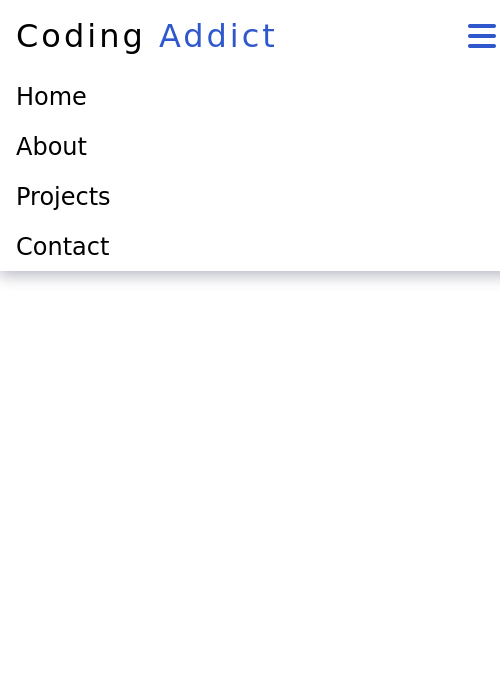

# Responsive Navbar

A responsive navbar component, it will hide menu items on smaller screens, showing a menu icoon from which the nav links can be accessed.

## Screenshots

## Installation

1. Clone the repository `git clone https://github.com/`
2. Open index.html on your browser.

## Features

- Menu button that shows only on smaller screens
- Responsive layout that shows and hides menu elements. 

## Technologies

- HTML
- CSS
- JavaScript

## License

This project is released under the Unlicense.  See LICENSE file [License](./LICENSE)

## Credits

Inspiered on the projects by John Smilga from [this video](https://youtu.be/3PHXvlpOkf4)